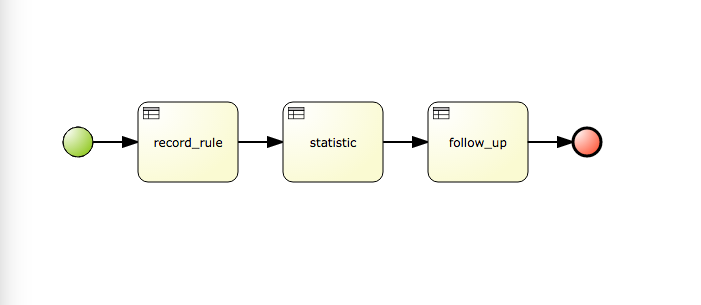

##什么是规则引擎？
>是一种嵌入在应用程序中的组件，实现了将业务决策从应用程序代码中分离出来，并使用预定义的语义模块编写业务决策。接受数据输入，解释业务规则，并根据业务规则做出业务决策。 - [百度百科](http://baike.baidu.com/view/1636209.htm)
##规则实现
一个规则文件以.drl扩展名结尾，完整的文件结构如下：
```java
  package
	 //包的路径名，跟java语法一致
    package-name
    //引入内部或外部的一些包或文件
    imports
    //定义全局变量
    globals
	//定义全局函数
    functions
	//定义查询过
    queries
	//定义业务规则
    rules
```
###Rules
```java
	rule
		"name"
		attrubutes
		when
	  LHS
		then
	  RHS
	end
```
####规则名称
每个规则文件的名称唯一
####attributes

* no-loop true, 当改变一个值不会触发该规则再次之行
* ruleflow-gorup, 每个规则有一个规则分组，某一个规则分组执行的时候，相应的所有规则都会被唤醒
* lock-on-active, ...
* salience, 同一个规则分组中规则执行的优先级，优先级相同的规则执行的顺序不固定
* agenda-group, ...
* auto-focus,...
* activatin-group, 活动分组相同的规则，其中一个规则被取消，剩下的规则也不会继续执行
* duration，规则延迟执行的时间
####When..Then
Drools中的核心功能，当满足When所给的条件的时候，就执行Then中的语句
#### Full Example
```java
	package test.account_rule
	rule 'rule rich'
		no-loop true
		ruleflow-group 'account_rule'
		when
			$a : Account(balance > 10000)
		then
			System.out.println('Rich');
	rule 'account normal'
		no-loop true
		ruleflow-group 'account_rule'
		when
			$a : Account(balance <= 10000, balance >= 1000)
		then
			Sysem.out.println('Normal');
	rule 'account poor'
		no-loop true
		ruleflow-group 'account_rule'
		when
			$a : Account(balance < 1000)
		then
			Sysem.out.println('Poor');
```

###数据对象
```java
	package test.account
	public class Account implements Serializable{
		private Double balance
		private String name
		....
		....
	}
```

###业务流程

一个业务流程拥有唯一的名称，供外部API调用时提供；
每个业务流程除了开始和结束节点，中间有若干个ruleflow，每个ruleflow执行完之后即执行下一个业务，直到结束

